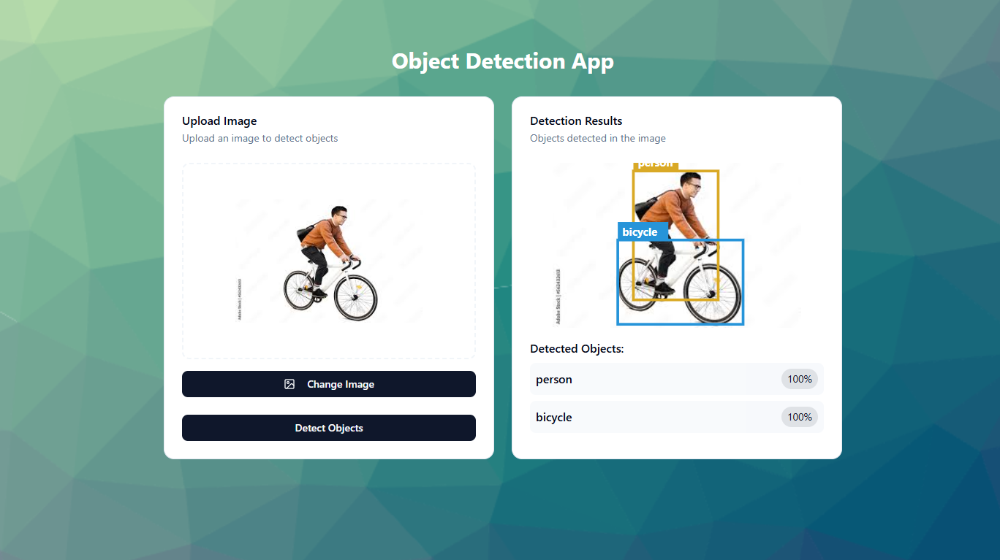

# 🧠 Object Detection App

A full-stack object detection web app that lets users upload images and returns bounding boxes for detected objects using a pre-trained machine learning model. Built with Flask, Next.js, and good vibes.

## ✨ Features

- Upload images through a modern drag-and-drop interface
- Automatically compresses large images client-side
- Sends images to a Flask backend with a Faster R-CNN model
- Displays detected objects with bounding boxes
- Funny fallback messages when nothing is detected
- Responsive dark-mode UI with a clean card layout

## 🛠️ Tech Stack

**Frontend:**
- Next.js (App Router)
- Tailwind CSS + ShadCN/UI
- JavaScript (client-side image compression)

**Backend:**
- Flask
- PyTorch + torchvision (Faster R-CNN)
- CORS enabled API

**Deployment:**
- Frontend: Vercel
- Backend: Railway (or Render/Fly.io fallback)

## 🖼️ Demo

[🔗 Live Demo](https://object-detector-frontend-two.vercel.app/)

## 🔧 Future Improvements

- Add object filtering or confidence threshold control
- Add model selection (YOLOv8, SSD, etc.)

## ⚠️ Limitations
Smarter models work great locally, but throw tantrums when deployed. Had to settle for a lighter one to keep things running smoothly (even if it occasionally calls a dog a horse 🐴).
